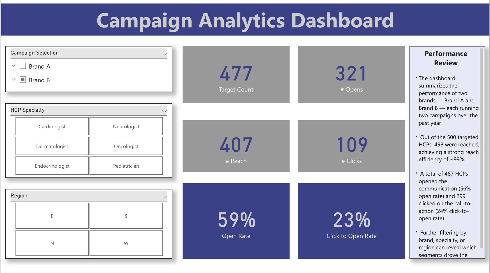
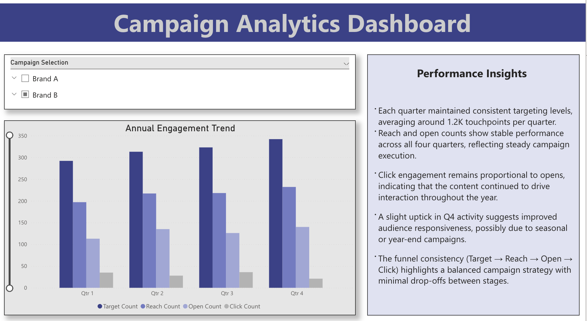

# 📊 Campaign Analytics Dashboard — Power BI Project  

## 🧩 Overview  
This Power BI dashboard provides an interactive analysis of **marketing campaign performance** across two pharmaceutical brands — *Brand A* and *Brand B* — over the course of a year. Each brand ran two campaigns targeted toward 500 healthcare professionals (HCPs).  

🔗 [Live Streamlit App](https://fg9rjtkknvjuekpohune7f.streamlit.app/)

The purpose of the dashboard is to visualize **engagement effectiveness** across the campaign funnel:  
**Target → Reach → Open → Click**, and to identify patterns by **brand, region, and HCP specialty.**

## 🎯 Problem Statement  
Pharmaceutical companies frequently run multiple digital campaigns to engage healthcare professionals (HCPs). However, tracking the effectiveness of these campaigns and understanding which audience segments respond best can be challenging.  

**Objective:**  
To build an interactive dashboard that enables marketing teams to:
- Evaluate campaign performance over time  
- Compare engagement across brands and campaigns  
- Identify high-performing HCP segments and regions  
- Derive actionable insights to improve targeting and content strategy  

## 📂 About the Data  
The dataset used in this project is **dummy data** generated for demonstration purposes. It represents 1 year of marketing activity, capturing campaign touchpoints for 500 HCPs across multiple specialties and regions (North, South, East, West).  

**Key Columns:**
- `hcp id` – Unique identifier for each healthcare professional  
- `brand name` – Brand running the campaign (Brand A / Brand B)  
- `campaign name` – Campaign title (Awareness, Engagement, Retention, New Launch)  
- `date of campaign` – Campaign execution date  
- `target (1 or 0)` – Whether the HCP was targeted  
- `reach (1 or 0)` – Whether the message was delivered  
- `open (1 or 0)` – Whether the message was opened  
- `click (1 or 0)` – Whether the CTA was clicked  
- `hcp specialty` – HCP’s medical specialty  
- `hcp region (N/S/E/W)` – Geographical region  

## ⚙️ Actions Taken  
1. **Data Preparation**
   - Cleaned and standardized dummy data in Excel and Python  
   - Verified logical consistency across funnel metrics (target, reach, open, click)  
   - Uploaded dataset to Power BI  

2. **Dashboard Development**
   - Created KPIs and DAX measures for Target Count, Reach Rate, Open Rate, and Click-to-Open Rate  
   - Built slicers for brand, region, and HCP specialty  
   - Designed three key dashboard views:
     - **Overview Page** – High-level performance summary  
     - **Annual Engagement Trend** – Quarter-wise comparison  
     - **HCP & Regional Segmentation** – Specialty and region breakdown  

## 📈 Results  

### **Overview Page**
Shows total HCP engagement funnel across all campaigns.  
> **Key Metrics:**  
> - Target Count: 500  
> - Reach: 498  
> - Open: 487  
> - Click: 299  
> - Open Rate: 56%  
> - Click-to-Open Rate: 24%  

### **Annual Engagement Trend**
Visualizes quarterly engagement trends for all campaign stages.  

 

**Insights:**
- Consistent targeting across all four quarters (~1.2K touchpoints per quarter).  
- Stable open and click behavior, showing strong retention.  
- Slight uplift in Q4 indicates improved audience interest, possibly due to seasonal campaigns.  

## 💼 Business Impact  
This dashboard demonstrates how marketing analysts can:
- Quantify **campaign effectiveness** at each funnel stage.  
- Identify **underperforming regions or HCP specialties**.  
- Optimize **content and timing** for higher engagement.  
- Support **data-driven decision-making** for future campaign planning.  

The structure can easily scale for real-world use cases by connecting to CRM or email automation platforms such as Veeva, Salesforce Marketing Cloud, or HubSpot.

## 🧠 Takeaways  
- Power BI enables quick transformation of campaign logs into actionable marketing insights.  
- Even with dummy data, analysts can simulate realistic reporting frameworks.  
- The **Target → Reach → Open → Click** funnel remains a powerful structure to measure digital effectiveness.  
- Strong visual storytelling helps communicate performance trends to stakeholders effectively.  

